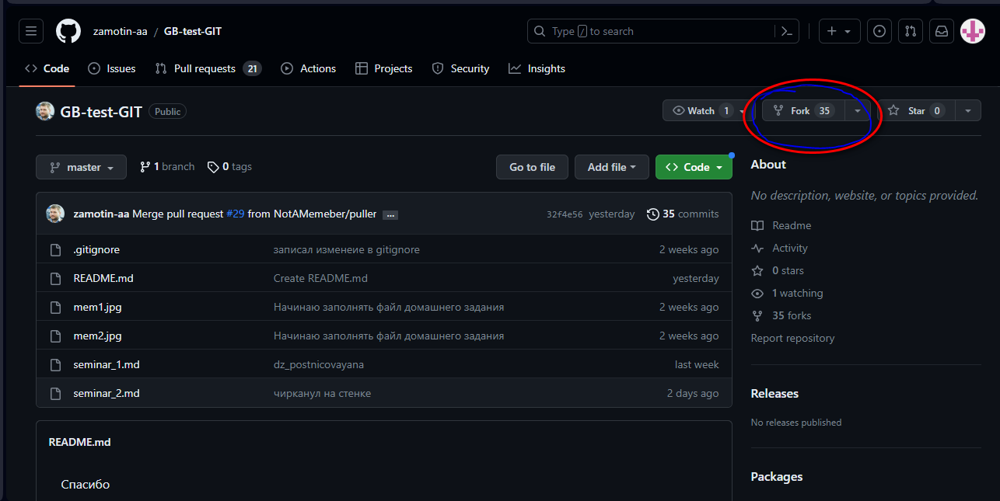
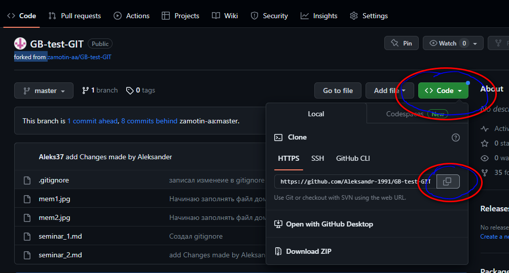
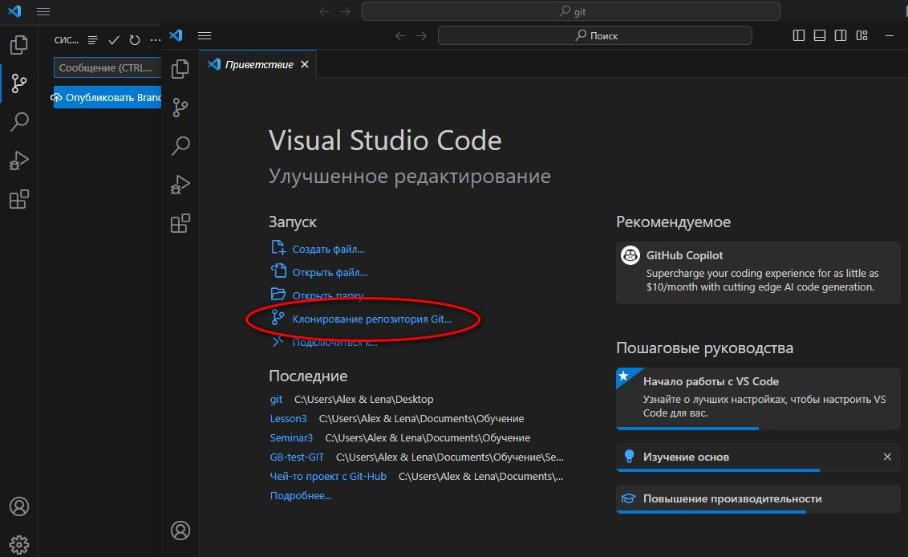
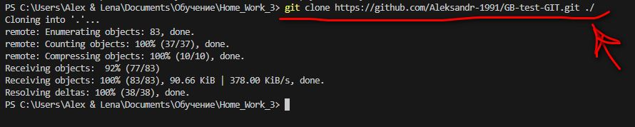
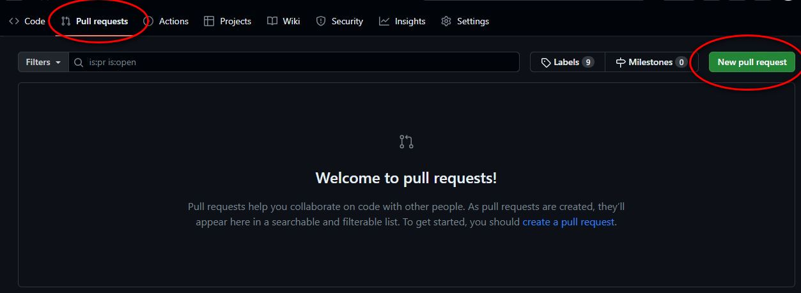

# Мое руководство по работе с GIT #

**Можно добавить картинку?**


*Можно!!!* Добавил еще комментарий

## Описываю команды ##

```
* git help - справка по всем командам
* git clone - клонировать репозиторий
* git status - посмотреть статус
* git add - добавить изменения
* git branch - создать ветку и перейти в нее 
* git checkout - переключаться между версиями
* git merge - команда слияния веток
* git remote - подключиться к удаленному репозиторию
* git fetch - загружает коммиты, файлы и ссылки из удаленного репозитория в ваш локальный репозиторий
* git push - отправить данные в удаленный репозиторий
* git pull - загружает коммиты, файлы и ссылки из удаленного репозитория в ваш локальный репозиторий
```

```
Удобно использовать команды
git log --oneline (выведет log в сжатом виде)
git log --oneline --graph (выведет то же самое в графическом виде)
```


### Пример нумерованного списка ###

1. Утверждение 1
2. Утверждение 2
    1. Вложенный список 1
    2. Вложенный список 2
3. Утверждение 3
4. Правильное утверждение 4

### Можно добавить ссылку URL ###

[](https://www.youtube.com/watch?v=T_tj8Shjp9o)

__Понравилось ?__

- [x] Все


Дописал комментарий 1

git log
git merge conflict

### Другая полезная информация ###

Полезные команды на будущее

1. git reset
2. git revert
3. git restore
4. git rebase
5. clear
6. git reflog
7. git branch -d name (удалить ветку)
8. git stash (push/pull/pop)
9. git squash (склеить коммиты)
10. конструкция cherry-pick
11. конструкция --amend

### Раздел про SSH ###

Можно подключаться к удаленному репозиторию не только по https но и по SSH - для этого надо получить ключ.

Дописал комментарий на сайте.


Дописали последнюю строку


Кто-то на облеке записал изменение.

### Мысли на счёт работы с Visual Studio Code: <br> (Created by of Alexander Lavrinov).

# Gamarjoba!
## Инструкция и основные формулы при работе во взаимодействии с Git-ом в программе Visual Studio Code.

*Работа в Гид начинаетя с таких пунктов как*:
1. **Создания папки**. Наименования папок необходимо производить на английском, преимущественно без пробелов и без верхних дефисов, во избежание дальнейших конфликтов.
2. В программе Visual Studio Code (далее по тексту **VSC**) необходимо нажать "*Открыть папку*" либо в средней части начального экрана, либо аналогичную на панели слева во вкладке "*Проводник*".<br> Затем найти расположение предварительно созданной папки и нажать пункт "*Выбрать папку*".
3. В верхней левой части программы в секции рядом со строкой, содержащей название выбранной папки, необходимо найти пункт "*Создать файл*". <br> **При создании наименования файла:**<br>  <u>Имя файла</u> должно быть создано без пробелов, без верхних дефисов и желательно без скобок. <br> <u>Расширение файла</u> в рамках изучения данного курса указываем как "***.md***".  <br> (Данный язык разметки является одним из относительно простых в освоении на просторах интернета).
4. Следующим пунктом открываем **терминал**. <br> * Либо мышью нашимаем на вкладку "*Терминал*", а в ней "*Создать терминал*"; <br> * либо на клавиатуре нам может помочь сочетание клавиш *СTRL + SHIFT + Тильда* (последний символ из соображений использования упомянутого языка разметки мы использовать в тектсте не станем). <br> 
`Что интересно`: сочетание клавиш *СTRL + Тильда* так же открывает Терминал.
5. Вводим команду **git init** <br> Она создает новый репозиторий Git. Большинство остальных команд Git невозможно использовать без инициализации репозитория, поэтому данная команда обычно выполняется первой в рамках нового проекта.
6. Для проверки того, что, как выразился один великий учёный древности, "**git** начал творить свою *магию*": <br> мы вводим команду **git version**. <br> Она отображает какой версии git установлен в данной системе, а также позволет нам проверить что они с **VSC** видят друг друга. <br> Также можно проверить в скрытых файлах корневой папки существование появившейся папки "*git*".
7. Следующим шагом лучше будет предствиться системе. <br> Вводим команду: <br> **git config --global user.name "*Ваш ник*"**. <br> Не вдаваясь в подробности, её посредством вы представитесь системе.
8. Аналогичным образом записываем в систему свою электронную почту. Нам поможет команда: <br> **git config --global user.email "*Ваш e-mail*"**.
9. Основными командами при работе же у вас будут команды, позволяющие внести сохранённые изменения,выразимся так, в память git-a; закомментировать их; просмотреть их а также вернуться к определённой стадии вашей работы, в случае если ваши внесённые изменения привели к неработоспособности вашего кода, либо к неожиданным результатам, либо по ещё какой-либо причине вас более не устраивают. <br> Само собой начнём мы с команды сохранения, или точнее внесения сохранённых в файле изменений в git: <br> (Важно! Перед введением команд в терминал необходимо сохранить файл (простого *СTRL + S*,  либо *command + S* для Mac-a - должно хватить)). <br> **git add .\ "*Название файла*".md** - данная команда добавляет изменение из рабочего каталога в раздел проиндексированных файлов. Она сообщает Git, что вы хотите включить изменения в конкретном файле в следующий коммит. Расширение должно, само собой соответствовать расширению вашего файла.
10. **git commit -m "Комментарий"** - на самом деле именно эта команда создаёт **Коммит** - изменения регистрируются в репозитории. <br> *Примечание*: Сам комментарий традиционно оставляют на английском.
11. **git log** - отображает отправленные снимки состояния и позволяет просматривать и фильтровать историю проекта, а также искать в ней конкретные изменения. Нам в лююом случае потребуется данная команда чтобы "вернуться" к определённому моменту нашей работы, или чтобы просмотреть историю внесённых изменений.
12. **git checkout** - позволяет переключаться между последними коммитами. В конце команды необходимо поставив пробел вписать либо первые 4 символа хеша коммита, либо весь хеш целиком.
13. **git checkout master** - позволяет вернуться к последнему по ходу изменений коммиту.

#### Данная ~~прекрасная работа~~ базовая инструкция может помочь вам начать освоение и понимание работы с Visual Studio Code и Git.

## Семинар 2-5.
№2 по Git (№5 общий на курсе).

## Краткая Записная книжка по командам:

<br> git status - команда вызывает блок инф. 
<br> git log - команда выводит все коммиты.
<br> git checkout - команда загружает коммит или ветвь.
<br> git branch - команда выводит все ветки.
<br> git merge - команда объединения веток.

## и ещё немного:

git init - команда создает новый репозиторий Git.

git version - команда отображает версию git установленого в данной системе.

git config --global user.name "*Ваш ник*" <br> - Представит вас системе. Внесёт в неё ваш ник.

git config --global user.email "*Ваш e-mail*" <br> - Внесёт в систему вашу электронную почту.

git add .\ "*Name_File*".md - данная команда добавляет изменение из рабочего каталога в раздел проиндексированных файлов.

git commit -m "Name_Commit" <br> - команда, благодаря которой изменения регистрируются в репозитории. <br> *Примечание*: Сам комментарий традиционно оставляют на английском. 

git branch Name_branch - команда создаёт ветвь с именем Name_branch.

git branch -d Name_Branch - Команда удаляет ветвь с именем "Name_Branch".

### ДЗ  №3 по контролю версий - (№6 - общий).

# Как пользоваться функциями "*Fork*", "*Clone*" и *"Pull requests*" для командной работы над проектом? <br> сейчас расскажем:
<br> Для ведения совместной общей работы в команде требуется система, в которой изменения, наработанные каждым сотрудником, могли бы быть приняты либо отвергнуты к основному проекту каким-либо контролирующим человеком или ведущим специалистом.

Для исполнения эфективного порядка работы необходимо придерживаться определённого алгоритма действий, работать по определённой, созданной специально для совместной работы, системе. Давайте рассмотрим список этих действий, создающих своего рода изящный порядок:

1. **Для начала** нам нужно выбрать интересующий нас роект, или тот проект, с которым связана наша рабочая деятельность. <br> Речь идёт о проектах, сохранённых в удалённых репозиториях на сервисе **"GitHub"**. <br>  Найдя необходимый нам репозиторий на сайте *"https://github.com"*, необходимо нажать кнопку *"Fork"* в верхней правой части сайта:



2. Нам сайт предложит перейти в раздел наших удалённых репозиториев. Среди оных **выбираем копию** только что "форкнутого" репозитория. Данная копия находится уже в нашем, а не в чужом аккаунте. <br> Чуть ниже названия репозитория аннотация гласит: "forked from *Name_Akk*" - что означает, что данная работа копирована с аккаунта пользователя с именем "*Name_Akk*".

3. В правой части нажимаем **кнопку *"Code"*** и в диалоговом окне **кнопку копирования ссылкки** на данный репозиторий. 



4. Создаём у себя на компьютере папку. А в **VSC** выбираем *"Клонирование репозитория Git*, а в строке сверху *"клонирование с Github"*,  либо в терминале вводим команду: <br>  **"git clone Ссылка_на_репозиторий ./Расположение_папки"**.
Где: Расположение_папки - путь на компьютере до той папки, в которую вы задумали воспроизвести клонирование.
<br> **! Причём!** Папка для клонирования должна быть пустой!
<br> **! Причём!**  Если в пути к вашей папке есть пробелы в названии папок, **либо в названии самого компьютера**, то данную часть указанного пути необходимо взять в кавычки.

Также можно сначала перейти в **VSC** в созданную папку с помощью команды **"cd Путь_к_директории"** (согласно правилам указанным выше). <br> А затем ввести команду: 

**"git clone Ссылка_на_репозиторий ./"** - так можно более дискретно отслеживать ошибки в своих действиях при введении команд.


Либо: .
Git, возможно попросит вас "подружить" удалённый репозиторий с локальным, либо дать подтверждение действий от аккаунта, которому вы доверяете. Всё подверрждаем.

5. Вносим желаемые изменения в клонированный локальный проект. Коммитим его, уже знаем как. Затем пушим его - вводим команду **"git push"**. "Закомиченные" изменения тем самым будут внесены на удалённый репозиторий на вашем аккаунте (как раз на тот, кый вы копировали изначально на свой аккаунт).

6. Заходим на сервис **Github** и находим удалённый репозиторий, с которым взаимодействует текущий локальный репозиторий.
<br> В верхней левой части сайта необходимо нажать "*Pull requests*". Затем в следующей странице слева - "*New pull requests*".



Т.о. мы предлагаем принять наши изменения и <br> перенести их из нашего удалённого репозитория (на нашем аккаунте) в удалённый репозиторий того аккаунта, с которого мы изначально "форкнули" проект.

#### Наши изменения будут приняты в случае, если владелец проекта сочтёт их полезными. А также после проверки их на наличине недочётов.

## Будем надеяться данная инструкция поможет вам в работе.

##### С наилучшими пожеланиями, ваш будущий коллега.